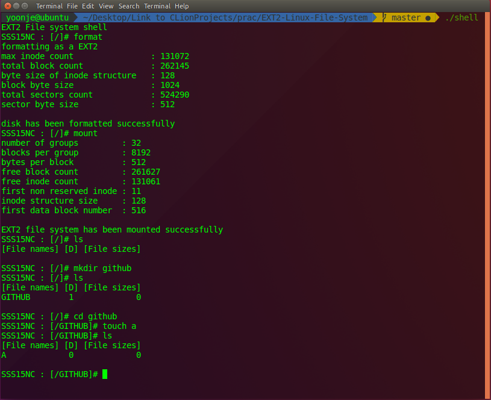

# EXT2-Linux-File-System
EXT2 file system emulator. It works like Linux does.<br>

# Action


## Run

```sh
$ make
```

```sh
$ ./shell
```

```sh
$ [/]# format
```

```sh
$ [/]# mount
```

After this commands you can use several shell command like touch, mkdir, mv, ls, cd...
